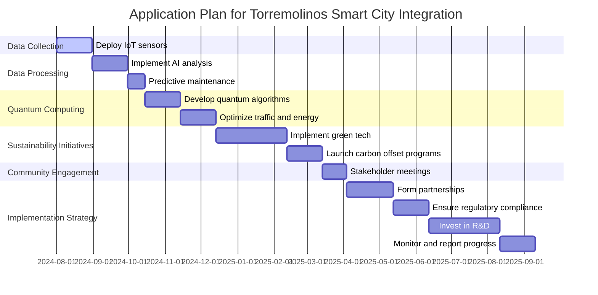

## AMPELChain Changelog and ROI Analysis

### High ROI Projects

**Project 1: Quantum Communication Network (APQ-CUZ-AP-GENSAI-CROSSPULSE-001)**
- **Description:** Secure communication leveraging quantum entanglement.
- **ROI Potential:** High

**Project 2: Quantum Algorithms for Aerodynamic Design (APQ-CUZ-AP-GENSAI-CROSSPULSE-002)**
- **Description:** Optimizing aircraft designs using quantum algorithms.
- **ROI Potential:** High

**Project 3: Quantum-Enhanced MRI Technology (APQ-CUZ-AP-GENSAI-CROSSPULSE-003)**
- **Description:** Improving MRI resolution and sensitivity using quantum mechanics.
- **ROI Potential:** Moderate to High

**Project 4: Quantum Financial Optimization (APQ-CUZ-AP-GENSAI-CROSSPULSE-004)**
- **Description:** Optimizing investment portfolios with quantum algorithms.
- **ROI Potential:** High

**Project 5: Quantum Environmental Monitoring (APQ-CUZ-AP-GENSAI-CROSSPULSE-005)**
- **Description:** Using quantum sensors for precise environmental monitoring.
- **ROI Potential:** Moderate

### Financial Integration and Automated Investment Strategy

**Weekly Investment Allocation (June to August):**
1. Ethereum (ETH): €50 per week
2. Solana (SOL): €50 per week
3. Binance Coin (BNB): €50 per week
4. Cardano (ADA): €50 per week
5. Ripple (XRP): €50 per week
6. PlayDoge (PLAY): €50 per week

**Additional Investment Allocation:**
- **July:** Reinforce positions in high-performing assets (ETH, SOL, BNB)
- **August:** Focus on emerging projects with high potential (Casper Network, SushiSwap)

### Automation and Validation

**Using Fin-AI Algorithms:**
- **DeltaOpt Function:** Dynamically adjust investments based on market trends.
- **Backtesting and Continuous Learning:** Validate the model with historical data and real-time adjustments.

### Portfolio Diversification

**Diversified Investment Strategy:**
- **Cryptocurrencies:** Ethereum, Solana, Binance Coin, Cardano, Ripple, PlayDoge
- **Stocks and ETFs:** Focus on technology and sustainable companies
- **Bonds:** ESG bonds for stable returns and reinvestment

### ESG Bonds and Reinvestment

**Reinvestment Plan:**
- **Initial Allocation:** 30% of gains to ESG bonds
- **Incremental Increase:** Increase reinvestment percentage as profits grow

### Automation Steps with Flask and PythonAnywhere

1. **Setup Flask Application:**
   - Create endpoints for balance checks, price fetching, and order placements.
2. **Deploy on PythonAnywhere:**
   - Utilize PythonAnywhere to host the Flask application and ensure it's accessible for automated scripts.

### Implementation Example

```python
from flask import Flask, request, jsonify
import requests
import alpaca_trade_api as tradeapi
from config import ALPACA_API_KEY, ALPACA_SECRET_KEY, ALPHA_VANTAGE_API_KEY

app = Flask(__name__)

# Initialize Alpaca API
api = tradeapi.REST(ALPACA_API_KEY, ALPACA_SECRET_KEY, base_url='https://paper-api.alpaca.markets')

def get_balance():
    account = api.get_account()
    balance = {
        'cash': account.cash,
        'portfolio_value': account.portfolio_value,
        'equity': account.equity
    }
    return balance

def get_price(symbol):
    endpoint = f'https://www.alphavantage.co/query?function=TIME_SERIES_INTRADAY&symbol={symbol}&interval=1min&apikey={ALPHA_VANTAGE_API_KEY}'
    response = requests.get(endpoint)
    data = response.json()
    latest_time = list(data['Time Series (1min)'].keys())[0]
    return float(data['Time Series (1min)'][latest_time]['1. open'])

def place_order(symbol, qty, side='buy'):
    api.submit_order(
        symbol=symbol,
        qty=qty,
        side=side,
        type='market',
        time_in_force='gtc'
    )
    return {'symbol': symbol, 'qty': qty, 'side': side}

@app.route('/balance', methods=['GET'])
def balance():
    balance = get_balance()
    return jsonify(balance)

@app.route('/prices', methods=['GET'])
def prices():
    symbols = request.args.get('symbols').split(',')
    prices = {symbol: get_price(symbol) for symbol in symbols}
    return jsonify(prices)

@app.route('/place-order', methods=['POST'])
def order():
    data = request.json
    symbol = data['symbol']
    qty = data['qty']
    side = data['side']
    order_response = place_order(symbol, qty, side)
    return jsonify(order_response)

if __name__ == '__main__':
    app.run(debug=True)
```

### Deployment on PythonAnywhere

1. Upload `app.py` and `config.py` to PythonAnywhere.
2. Setup Virtual Environment: `mkvirtualenv my-virtualenv --python=python3.8`
3. `pip install flask requests alpaca-trade-api`
4. Configure Web App: Set up the web app on PythonAnywhere to run the Flask application.
5. Monitor and Adjust: Use PythonAnywhere’s logs and monitoring tools to ensure the application runs smoothly.

### Conclusion

By integrating your financial situation, leveraging your projects, and using advanced algorithms, you can achieve your financial goals while maintaining a diversified and sustainable investment strategy. This plan ensures you are maximizing returns and reinvesting in ESG bonds, contributing to both personal growth and societal impact.### EPIC-DM #Compatible: ChatQuantum

**Long-term Objective:**
Position Amedeo Pelliccia as a leader in Quantum GreenTech and Computing, leveraging the innovative platform ChatQuantum.

## Description:
ChatQuantum integrates IoT, AI, next-gen algorithms, and quantum computing to enhance sustainability and quality of life. The platform addresses data science, physics, cosmology, and digital ethics with a focus on European integration and data justice.

### Best Smart City Model by Ampel Systems
### Summary of the Application Plan

The plan to implement the Intelligent Artificial Quantum Unified System (1AQU) in Torremolinos includes key components such as data collection, data processing, quantum computing, sustainability initiatives, and community engagement. The implementation strategy involves collaboration, regulatory compliance, innovation, monitoring, and reporting.

### Mermaid Gantt Chart Code



### Rendering the Gantt Chart

I will now render the Gantt chart to ensure it is valid and visually accurate.
**Objective:**
Enhance urban living with IoT, AI, and quantum computing.

**Key Components:**
1. **IoT Integration:** Real-time data from traffic, environment, and safety sensors.
2. **AI Analytics:** Data processing, pattern recognition, and predictions.
3. **Quantum Computing:** Optimization of traffic and energy distribution.
4. **Sustainability:** Green technologies and sustainable planning.
5. **Citizen Engagement:** User-friendly interfaces for city services and feedback.

**Implementation Steps:**
1. **Data Collection:** Install and secure IoT devices.
2. **Data Processing:** Analyze data with AI models.
3. **Optimization:** Use quantum computing for complex challenges.
4. **Visualization:** Real-time dashboards and applications.
5. **Testing and Iteration:** Pilot projects and refine based on feedback.
6. **Scalability:** Expand the model to other areas.

**Outcome:**
Create a smart city model that improves infrastructure, sustainability, and citizen engagement.

## Features:
- **NLP and ML:** Context-aware AI with multilingual support.
- **Quantum Computing:** Enhanced processing and security.
- **IoT Integration:** Smart automation and monitoring.
- **Sustainability:** Energy and resource optimization.

## Strategic Goals:
- Seamless user interactions.
- Innovation in various sectors.
- Promote sustainability.

## Implementation Strategy:
1. Research and develop core technologies.
2. Pilot real-world projects.
3. Full-scale deployment and continuous improvement.

## Example Projects:
- **Healthcare Assistant Bot:** Real-time health monitoring.
- **Smart Home Manager:** Energy optimization for homes.
- **Financial Advisor Bot:** Personalized financial advice.

## Collaboration and Community:
- Partnerships with tech companies and institutions.
- Open-source contributions.

## Contact:
- **Email:** amedeo.pelliccia@icloud.com
- **GitHub:** [AmePelliccia](https://github.com/AmePelliccia)

## License:
MIT License

For more details, visit the GitHub repository: [AmePelliccia](https://github.com/AmePelliccia)