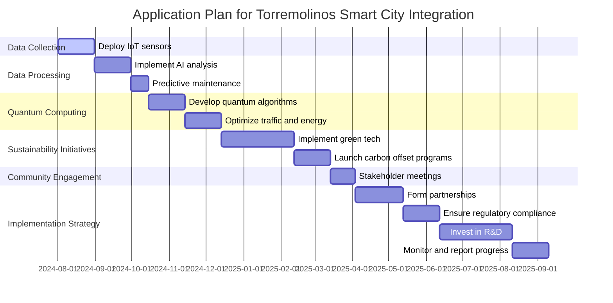

### EPIC-DM #Compatible: ChatQuantum

**Long-term Objective:**
Position Amedeo Pelliccia as a leader in Quantum GreenTech and Computing, leveraging the innovative platform ChatQuantum.

## Description:
ChatQuantum integrates IoT, AI, next-gen algorithms, and quantum computing to enhance sustainability and quality of life. The platform addresses data science, physics, cosmology, and digital ethics with a focus on European integration and data justice.

### Best Smart City Model by Ampel Systems
### Summary of the Application Plan

The plan to implement the Intelligent Artificial Quantum Unified System (1AQU) in Torremolinos includes key components such as data collection, data processing, quantum computing, sustainability initiatives, and community engagement. The implementation strategy involves collaboration, regulatory compliance, innovation, monitoring, and reporting.

### Mermaid Gantt Chart Code

### Rendering the Gantt Chart

I will now render the Gantt chart to ensure it is valid and visually accurate.
**Objective:**
Enhance urban living with IoT, AI, and quantum computing.

**Key Components:**
1. **IoT Integration:** Real-time data from traffic, environment, and safety sensors.
2. **AI Analytics:** Data processing, pattern recognition, and predictions.
3. **Quantum Computing:** Optimization of traffic and energy distribution.
4. **Sustainability:** Green technologies and sustainable planning.
5. **Citizen Engagement:** User-friendly interfaces for city services and feedback.

**Implementation Steps:**
1. **Data Collection:** Install and secure IoT devices.
2. **Data Processing:** Analyze data with AI models.
3. **Optimization:** Use quantum computing for complex challenges.
4. **Visualization:** Real-time dashboards and applications.
5. **Testing and Iteration:** Pilot projects and refine based on feedback.
6. **Scalability:** Expand the model to other areas.

**Outcome:**
Create a smart city model that improves infrastructure, sustainability, and citizen engagement.

## Features:
- **NLP and ML:** Context-aware AI with multilingual support.
- **Quantum Computing:** Enhanced processing and security.
- **IoT Integration:** Smart automation and monitoring.
- **Sustainability:** Energy and resource optimization.

## Strategic Goals:
- Seamless user interactions.
- Innovation in various sectors.
- Promote sustainability.

## Implementation Strategy:
1. Research and develop core technologies.
2. Pilot real-world projects.
3. Full-scale deployment and continuous improvement.

## Example Projects:
- **Healthcare Assistant Bot:** Real-time health monitoring.
- **Smart Home Manager:** Energy optimization for homes.
- **Financial Advisor Bot:** Personalized financial advice.

## Collaboration and Community:
- Partnerships with tech companies and institutions.
- Open-source contributions.

## Contact:
- **Email:** amedeo.pelliccia@icloud.com
- **GitHub:** [AmePelliccia](https://github.com/AmePelliccia)

## License:
MIT License

For more details, visit the GitHub repository: [AmePelliccia](https://github.com/AmePelliccia)